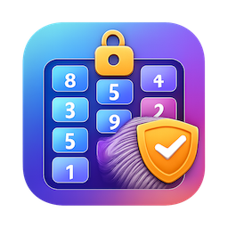
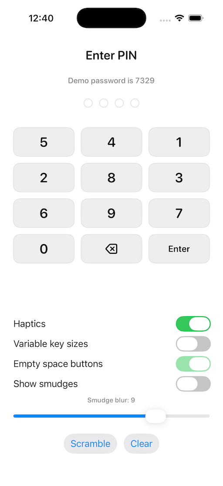
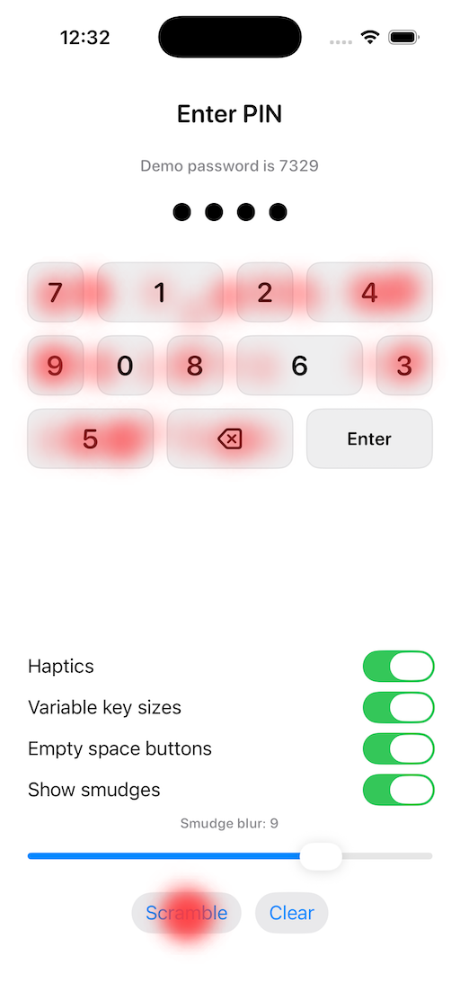
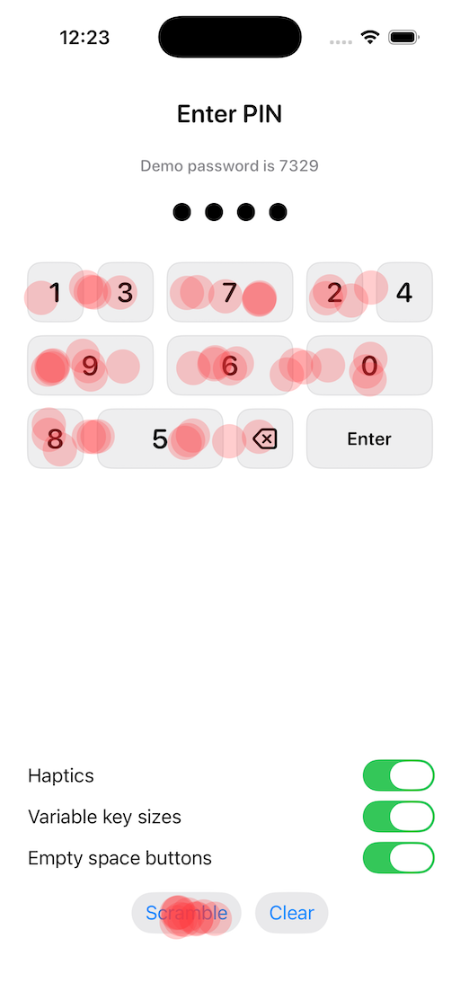

# ScrambledKeypad



A SwiftUI keypad that randomizes digit positions on every appearance to help reduce smudge-based pattern attacks.

## Features
- Randomizes digits 0-9 on each appearance
- Optional delete and enter keys
- Manual re-scramble via `scrambleTrigger`
- Fast scramble animation on re-shuffle
- Optional haptics on key presses
- Optional variable key sizes to reduce smudge patterns
- Simple SwiftUI `View` API
- Lightweight and dependency-free

## Illustrations





Docs-only assets above are not bundled as package resources.

## Installation
Add the package in Xcode via **File > Add Packages...** and select the repository folder, or reference it in another Swift package:

```swift
.package(path: "../scrambled_keypad")
```

## Usage
```swift
import SwiftUI
import ScrambledKeypad

struct PinEntryView: View {
    @State private var entered: [Int] = []

    var body: some View {
        VStack(spacing: 20) {
            HStack(spacing: 10) {
                ForEach(0..<4, id: \.self) { index in
                    Circle()
                        .strokeBorder(Color.gray.opacity(0.3), lineWidth: 1)
                        .background(
                            Circle().fill(index < entered.count ? Color.primary : Color.clear)
                        )
                        .frame(width: 14, height: 14)
                }
            }

            ScrambledKeypad(
                includeDelete: true,
                onKeyPress: { digit in
                    guard entered.count < 4 else { return }
                    entered.append(digit)
                },
                onDelete: {
                    _ = entered.popLast()
                }
            )
        }
        .padding()
    }
}
```

## Example iOS App
Open `Examples/ScambledKeypadExample/ScambledKeypadExample.xcodeproj` in Xcode and run on an iOS simulator or device.

## Notes
- The keypad shuffles when it appears. If you need a re-shuffle mid-session, recreate the view or toggle its visibility.
